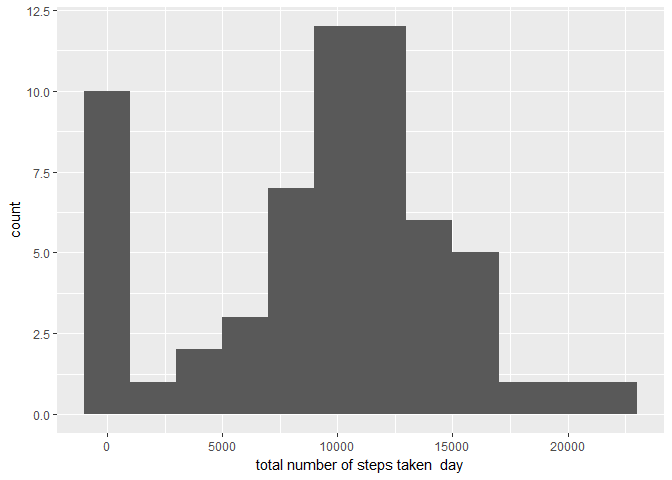
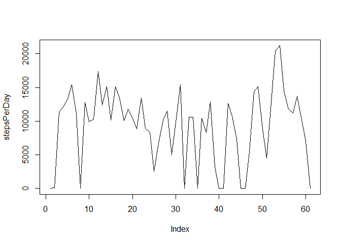
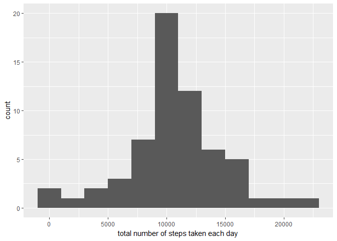

### Personal Activity Monitoring

#### Review of data from anonymous individual taken at 5 minute intervals

### Loading and preprocessing the data

#### Show any code that is needed toLoad the data (i.e. read.csv())

    #Load Training Data
    data <- read.csv(file="activity.csv", header=TRUE, as.is = TRUE, stringsAsFactors = FALSE, sep=",", na.strings=c('NA','','#DIV/0!'))

#### **1. Histogram of the total steps taken each day**

    stepsPerDay <- tapply(data$steps, data$date, FUN = sum, na.rm = TRUE)
    qplot(stepsPerDay, binwidth = 2000, xlab = "total number of steps taken  day")

#### **2. Mean and median number of steps taken each day**

    mean(stepsPerDay, na.rm=TRUE)

    ## [1] 9354.23

    median(stepsPerDay, na.rm=TRUE)

    ## [1] 10395

#### **3. Time series plot of the average number of steps taken**

    averagesVar <- aggregate(x=list(steps=data$steps), by=list(interval=data$interval), FUN=mean, na.rm=TRUE)

    plot(averagesVar, type = "l")

    plot(stepsPerDay,type = "l")

    ggplot(data = averagesVar, aes(x = interval, y = steps)) + geom_line() + xlab("5-minute interval") + ylab("average number of steps taken")

**4. The 5-minute interval that, on average, contains the maximum number
of steps**

    averagesVar[which.max(averagesVar$steps), ]

    ##     interval    steps
    ## 104      835 206.1698

**5. Code to describe and show a strategy for imputing missing data**

#### replace all NA values with the mean

    missing <- is.na(data$steps)
    #How many missing
    table(missing)

    ## missing
    ## FALSE  TRUE 
    ## 15264  2304

    # Replace each missing value with the mean value of its 5-minute interval
    filledValue <- function(steps, interval) {
        filled <- NA
        if (!is.na(steps)) 
            filled <- c(steps) else filled <- (averagesVar[averagesVar$interval == interval, "steps"])
        return(filled)
    }
    filledData <- data
    filledData$steps <- mapply(filledValue, filledData$steps, filledData$interval)

    missing2 <- is.na(filledData$steps)
    # How many missing
    table(missing2)

    ## missing2
    ## FALSE 
    ## 17568

**6. Histogram of the total number of steps taken each day after missing
values are imputed**

    stepsPerDay <- tapply(filledData$steps, data$date, FUN = sum, na.rm = TRUE)
    qplot(stepsPerDay, binwidth = 2000, xlab = "total number of steps taken each day")

**7. Panel plot comparing the average number of steps taken per 5-minute
interval across weekdays and weekends**

    weekdayWeekend <- function(date) {day <- weekdays(date) 
    if (day %in% c("Monday", "Tuesday", "Wednesday", "Thursday", "Friday"))
        return("weekday") else if (day %in% c("Saturday", "Sunday")) 
        return("weekend") else stop("invalid date")
    }

    filledData$date <- as.Date(filledData$date)
    filledData$day <- sapply(filledData$date, FUN = weekdayWeekend)

    averagesVar <- aggregate(steps ~ interval + day, data = filledData, mean)
    ggplot(averagesVar, aes(interval, steps)) + geom_line() + facet_grid(day ~ .) + 
        xlab("5-minute interval") + ylab("Number of steps")

    mean(stepsPerDay)

    ## [1] 10766.19

    median(stepsPerDay)

    ## [1] 10766.19

**8. All of the R code needed to reproduce the results (numbers, plots,
etc.) in the report** \#\#\#\# All of the above code along with the
dataset should fulfill this requirement.

##### Please note: there are no separate figures as the output is html5 which embeds the figures internally in the document as data/scripts
